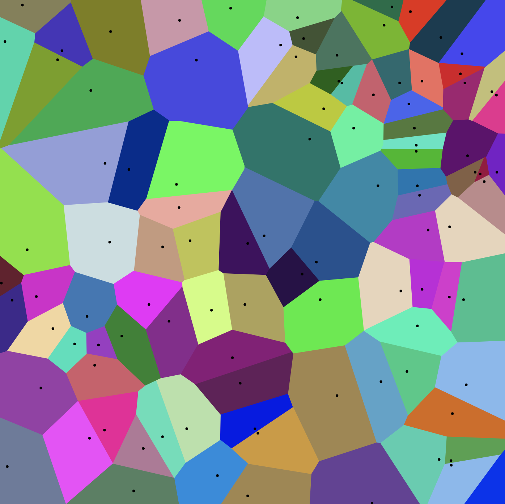

# Information Retrieval with ANN Demo
--

*Information retrieval (IR) is finding material (usually documents) of
an unstructured nature (usually text) that satisfies an information need
from within large collections (usually stored on computers).*

Nearest Neighbor Search (NNS) is a fundamental building block in IR and also in various other application domains, such as pattern recognition, data mining, and recommendation
systems.

## Approximate Nearest Neighbor Search

Most modern applications have massive data with high dimensionality. For those cases NNS becomes impractical and **Approximate Nearest Neighbor Search (ANNS or ANN)** takes its place.
With the advances of Representation Learning and the production of dense vectors with semantically-rich document representations, ANN gained more relevance in high scale similarity search applications.

With the advances of Representation Learning and the production of dense vectors with semantically-rich document representations, ANN gained more relevance in high scale similarity search applications.

This repo containts a guide to some of the most important ANN paradigms and algorithms:

**ANN Paradigms**:

- Local Sensitive Hash (LSH)
- Trees
- Product Quatization
- Proximity Graphs 

## Google Slides Presentation
[Approximate Nearest Neighbor Search in Information Retrieval](https://docs.google.com/presentation/d/1JNpPPHXwKpr8aubSYhxUbdanM6Mvr6rHNwPQn0vXOQA/edit?usp=sharing)

## Author:
Guilherme K. Gomes

- <guiligomes@gmail.com>
- <https://linkedin.com/in/guilherme-klein-gomes-3218b7127/>
- <https://github.com/GuiliGomes>
